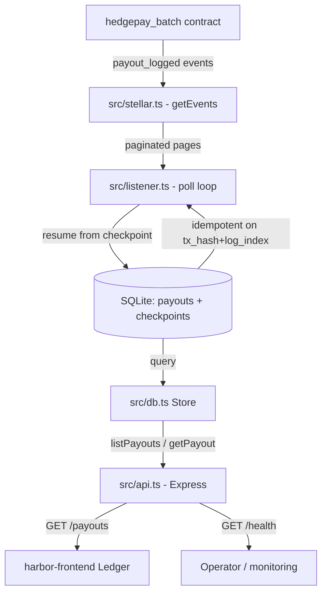

# Harbor Backend

Soroban event listener, payout indexer (SQLite), and REST API for Harbor — the off-chain service that watches the `hedegpay_batch` contract for `payout` events and serves them to [harbor-frontend](https://github.com/Harbor-hq/harbor-frontend).

## CI Coverage

Local gates enforced before every push: `npm run typecheck`, `npm test`, `npm run build`.

## Tech stack

- Node.js (>= 22.5) + TypeScript
- `@stellar/stellar-sdk` 12
- Express 4
- Node's built-in `node:sqlite` (no ORM/database dependency)

## Quickstart

```bash
npm install
cp .env.example .env   # then fill in CONTRACT_ID
npm run dev            # tsx watch, listens on :8787
```

By default the service runs on the public Soroban testnet with a **mock** contract id so it boots without setup — set `CONTRACT_ID` to your deployed `hedegpay_batch` contract to index real events.

### Scripts

| Script                 | What it does                     |
| ---------------------- | -------------------------------- |
| `npm run dev`          | Run with hot reload (`tsx watch`) |
| `npm run build`        | Compile TS to `dist/`            |
| `npm start`            | Run compiled `dist/`             |
| `npm run typecheck`    | `tsc --noEmit`                   |
| `npm test`             | Run the unit tests (`node:test`) |

## What's included

1. **Event listener** — polls the Soroban network for `payout` events on the configured contract, resuming from checkpoints so nothing is lost across restarts (`src/listener.ts`).
2. **SQLite indexer** — indexes events into a local SQLite database, idempotent on `(tx_hash, log_index)` (`src/db.ts`).
3. **REST API** — serves indexed payouts to harbor-frontend (`src/api.ts`).

### API

See [docs/API.md](docs/API.md) for the full reference.

| Endpoint               | Description                              |
| ---------------------- | ---------------------------------------- |
| `GET /health`          | Listener + indexer status                |
| `GET /payouts`         | List indexed payouts (paginated, filterable) |
| `GET /payouts/:txHash` | Single payout by transaction hash        |

The `/payouts` shape matches what `harbor-frontend`'s `fetchPayoutEvents` consumes, so a frontend can point `NEXT_PUBLIC_HARBOR_EVENTS_URL` at this service.

### Configuration

All via env vars (see `.env.example`):

| Variable           | Default                          | Purpose                        |
| ------------------ | -------------------------------- | ------------------------------ |
| `RPC_URL`          | soroban-testnet                  | Soroban RPC endpoint           |
| `CONTRACT_ID`      | mock placeholder                 | `hedegpay_batch` contract address |
| `TOKEN_SYMBOL`     | `USDC`                           | Token label surfaced in the API |
| `TOKEN_DECIMALS`   | `6`                              | Decimal places used to format amounts |
| `HOST` / `PORT`    | `0.0.0.0` / `8787`               | HTTP server bind               |
| `POLL_INTERVAL_MS` | `5000`                           | Event listener poll interval   |
| `START_LEDGER_BACK`| `10`                             | Ledgers back to index on first run |
| `DB_PATH`          | `./data/harbor.db`               | SQLite database file           |

## Architecture & Flow

The following diagram illustrates how the listener, the SQLite indexer, and the REST API fit together with the Soroban contract and the frontend.



```text
 +------------------------+   payout_logged   +---------------------------+
 |  hedegpay_batch (on-chain)  |----------------->|  src/stellar.ts         |
 +------------------------+                    |  fetchContractEvents     |
                                                +-------------+-----------+
                                                              | paginated pages
                                                              v
                                                +---------------------------+
                                                |  src/listener.ts          |
                                                |  - checkpointed poll loop |
                                                |  - parsePayoutEvent       |
                                                +-------------+-----------+
                                                              |
                                             insertPayout (idempotent)
                                                              v
                                                +---------------------------+
                                                |   SQLite (payouts,        |
                                                |   checkpoints)            |
                                                +-------------+-----------+
                                                              | Store queries
                                                              v
                                                +---------------------------+
                                                |  src/api.ts (Express)     |
                                                |  GET /health              |
                                                |  GET /payouts             |
                                                |  GET /payouts/:txHash     |
                                                +-------------+-----------+
                                                              |
                                                              v
                                                +---------------------------+
                                                |  harbor-frontend Ledger   |
                                                +---------------------------+
```

## Local setup

Prerequisites: Node.js >= 22.5 (for `node:sqlite`).

```bash
npm install
cp .env.example .env   # then fill in CONTRACT_ID
npm run dev
```

## Development

Use one branch per issue or feature. Follow these conventions:

- Keep all network/contract access inside `src/stellar.ts`.
- Store access goes through the `Store` class in `src/db.ts` — endpoints never issue raw SQL.
- New REST endpoints live in `src/api.ts` and must be documented in `docs/API.md`.
- Amounts are handled in **base units**; format for output with `fromBaseUnits` (`src/amount.ts`).
- SQLite columns that hold i128 amounts are `TEXT` (avoid BigInt precision loss).
- No new runtime dependencies without discussing in the PR — the service is intentionally dependency-light (`node:sqlite`, no ORM).

Verify with `npm run typecheck`, `npm test`, and `npm run build`.

## Test coverage

The project ships `node:test` suites for the amount helpers and the listener:

```bash
# Run locally
npm test
```

See [docs/ROADMAP.md](docs/ROADMAP.md) for the next contribution opportunities, including indexing `executed` batch events, real SEP-24/31 anchor integration, API-key auth, Zod validation, Dockerization, Prometheus metrics, multi-contract support, and ERP sync.

## Project layout

```
harbor-backend/
├── .env.example                   # Env template
├── src/
│   ├── config.ts                  # Env configuration
│   ├── db.ts                      # SQLite schema + queries (payouts, checkpoints)
│   ├── stellar.ts                 # Soroban RPC helpers + paginated event fetch
│   ├── listener.ts                # Checkpointed event-polling loop
│   ├── amount.ts                  # i128 <-> decimal amount helpers
│   ├── api.ts                     # Express HTTP API
│   ├── server.ts                  # Entry point (listener + API)
│   ├── amount.test.ts             # Unit tests: amount helpers
│   └── listener.test.ts           # Unit tests: listener
├── docs/
│   ├── API.md                     # REST endpoint reference
│   └── ROADMAP.md                 # Contribution opportunities
└── CONTRIBUTING.md                # Developer setup + PR workflow
```

## Operator Guide

Backend operators setting up a new deployment:

1. Deploy `hedgepay_batch` (see [Harbor-hq/harbor](https://github.com/Harbor-hq/harbor)).
2. Set `CONTRACT_ID` to the deployed contract's C-address.
3. Set `DB_PATH` to a persistent volume; the listener resumes from `checkpoints` so no events are lost across restarts.
4. Set `RPC_URL`, `TOKEN_SYMBOL`, and `TOKEN_DECIMALS` to match your network and settlement token.
5. Point harbor-frontend's `NEXT_PUBLIC_HARBOR_EVENTS_URL` at `http://<host>:8787/payouts`.
6. Verify with `GET /health` (listener running, payout count, last ledger).

## Security Notes

- **Checkpointed indexing:** the listener stores `checkpoints` per contract and resumes from the last processed ledger, so restarts never double-index or lose events.
- **Idempotency:** payouts are keyed on `(tx_hash, log_index)` with `INSERT OR IGNORE`, so replays are safe.
- **Amount handling:** amounts are stored as `TEXT` base units to avoid BigInt precision loss in SQLite; formatted with `fromBaseUnits`.
- **Dependency-light:** uses `node:sqlite` — no ORM, no runtime deps beyond Express and the Stellar SDK.
- **Input bounds:** `limit` is clamped to `1..200` on `/payouts`.

## Part of Harbor

Contracts: [Harbor-hq/harbor](https://github.com/Harbor-hq/harbor) · Frontend: [Harbor-hq/harbor-frontend](https://github.com/Harbor-hq/harbor-frontend)
