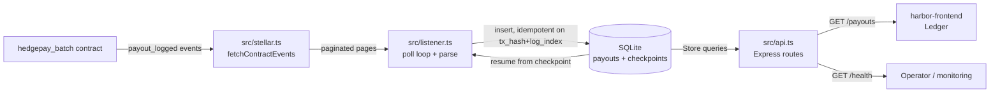

# Harbor Backend

The off-chain service for the **Harbor batch-payroll protocol**: a Soroban event listener, a payout indexer backed by SQLite, and a REST API that serves indexed payouts to [harbor-frontend](https://github.com/Harbor-hq/harbor-frontend).

This service:

1. **Listens** for `payout` events emitted by the `hedgepay_batch` contract on Soroban (resuming from checkpoints so nothing is lost across restarts).
2. **Indexes** them into a local SQLite database (idempotent on `(tx_hash, log_index)`).
3. **Serves** them over a small REST API consumed by harbor-frontend.

Built with Node + TypeScript, `@stellar/stellar-sdk`, Express, and Node's built-in `node:sqlite` (no ORM/database dependency).

## Table of Contents

- [Tech stack](#tech-stack)
- [Quickstart](#quickstart)
- [What's included](#whats-included)
- [Architecture & Flow](#architecture--flow)
- [Local setup](#local-setup)
- [Development](#development)
- [Test coverage](#test-coverage)
- [Project layout](#project-layout)
- [Operator Guide](#operator-guide)
- [Security Notes](#security-notes)
- [Part of Harbor](#part-of-harbor)

## Tech stack

- **Runtime:** Node.js >= 22.5 (required for `node:sqlite`)
- **Language:** TypeScript (ESM, `tsx` for dev)
- **Stellar SDK:** `@stellar/stellar-sdk` 12
- **HTTP:** Express 4
- **Storage:** SQLite via the built-in `node:sqlite` module — no ORM, no database dependency
- **Tests:** `node:test`

## Quickstart

```bash
npm install
cp .env.example .env   # then fill in CONTRACT_ID
npm run dev            # tsx watch, listens on :8787
```

By default the service runs on the public Soroban testnet with a **mock** contract id so it boots without setup — set `CONTRACT_ID` to your deployed `hedgepay_batch` contract to index real events.

### Scripts

| Script              | What it does                          |
| ------------------- | ------------------------------------- |
| `npm run dev`       | Run with hot reload (`tsx watch`)     |
| `npm run build`     | Compile TypeScript to `dist/`         |
| `npm start`         | Run the compiled `dist/`              |
| `npm run typecheck` | `tsc --noEmit`                        |
| `npm test`          | Run the unit tests (`node:test`)      |

## What's included

The service is split into focused modules under `src/`:

| Module | Responsibility |
| --- | --- |
| `config.ts` | Reads and validates environment configuration (env -> default). |
| `stellar.ts` | All Soroban RPC access: server construction + paginated event fetching. |
| `listener.ts` | Checkpointed event-polling loop; decodes `payout` events into records. |
| `db.ts` | SQLite schema + queries via the `Store` class (payouts, checkpoints). |
| `amount.ts` | i128 <-> decimal amount helpers. |
| `api.ts` | Express HTTP API. |
| `server.ts` | Entry point — boots the listener and the API together, handles graceful shutdown. |

### Event listener (`src/listener.ts`)

- Polls the Soroban network every `POLL_INTERVAL_MS` (default 5000 ms).
- On each poll: fetches the latest ledger, reads the stored checkpoint, fetches all contract events from `checkpoint + 1` to the latest ledger (draining pagination via paging tokens), parses `payout` events, inserts them idempotently, then advances the checkpoint.
- On first run it starts `START_LEDGER_BACK` (default 10) ledgers back to backfill.
- Errors are captured into listener state (`lastError`) without killing the process; the next poll retries.
- A decoded `payout` event looks like:
  - topic: `[Symbol("payout"), u64 batch_id, Address payee]`
  - data: `[i128 amount, Symbol department]`

### SQLite indexer (`src/db.ts`)

- **`payouts` table** keyed on `(tx_hash, log_index)` — `INSERT OR IGNORE`, so replays never duplicate rows. Amounts are stored as `TEXT` in base units to avoid BigInt precision loss.
- **`checkpoints` table** keyed on `contract_id` — the listener resumes from here.
- Indexes on `batch_id`, `payee`, and `ledger` keep filtered queries fast.

### REST API (`src/api.ts`)

| Endpoint | Description | Query params |
| --- | --- | --- |
| `GET /health` | Listener + indexer status (running, lastPoll, lastError, processed, lastLedger, payoutCount) | — |
| `GET /payouts` | List indexed payouts, newest first, paginated + filterable | `limit` (1–200, default 50), `cursor`, `batchId`, `payee` |
| `GET /payouts/:txHash` | Single payout by transaction hash (first event for that hash) | — |

The `/payouts` shape matches what `harbor-frontend`'s `fetchPayoutEvents` consumes, so a frontend can point `NEXT_PUBLIC_HARBOR_EVENTS_URL` at this service.

Example `/payouts` response:

```json
{
  "payouts": [
    {
      "txHash": "deadbeef...",
      "index": 0,
      "batchId": "7",
      "payee": "GA5G2...",
      "amount": "250.5",
      "token": "USDC",
      "date": "2026-05-10T12:00:00.000Z",
      "ledger": 123456
    }
  ],
  "nextCursor": 42
}
```

### Configuration

All via env vars (see `.env.example`):

| Variable | Default | Purpose |
| --- | --- | --- |
| `RPC_URL` | soroban-testnet | Soroban RPC endpoint |
| `CONTRACT_ID` | mock placeholder | `hedgepay_batch` contract address |
| `TOKEN_SYMBOL` | `USDC` | Token label surfaced in the API |
| `TOKEN_DECIMALS` | `6` | Decimal places used to format amounts |
| `HOST` / `PORT` | `0.0.0.0` / `8787` | HTTP server bind |
| `POLL_INTERVAL_MS` | `5000` | Event listener poll interval |
| `START_LEDGER_BACK` | `10` | Ledgers back to index on first run |
| `DB_PATH` | `./data/harbor.db` | SQLite database file |

## Architecture & Flow

The following **Mermaid** diagram renders natively on GitHub:



And the equivalent ASCII flow:

```
 +---------------------+   payout_logged    +------------------------+
 | hedegpay_batch      |-------------------->| src/stellar.ts        |
 | (Soroban contract)  |                     | fetchContractEvents   |
 +---------------------+                     +-----------+-----------+
                                                          |  paginated pages
                                                          v
                                                +------------------------+
                                                | src/listener.ts       |
                                                | checkpointed poll loop|
                                                | parsePayoutEvent      |
                                                +-----------+-----------+
                                                          |  insert (idempotent)
                                                          v
                                                +------------------------+
                                                | SQLite                |
                                                | payouts + checkpoints |
                                                +-----------+-----------+
                                                          |  Store queries
                                                          v
                                                +------------------------+
                                                | src/api.ts (Express)  |
                                                | GET /health           |
                                                | GET /payouts          |
                                                | GET /payouts/:txHash  |
                                                +-----------+-----------+
                                                          |
                                                          v
                                                +------------------------+
                                                | harbor-frontend Ledger |
                                                +------------------------+
```

## Local setup

Prerequisites: Node.js >= 22.5 (for `node:sqlite`).

```bash
npm install
cp .env.example .env   # then fill in CONTRACT_ID
npm run dev
```

Open [http://localhost:8787/health](http://localhost:8787/health) to see listener + indexer status.

## Development

Use one branch per issue or feature. Follow these conventions:

- Keep all network/contract access inside `src/stellar.ts`.
- Store access goes through the `Store` class in `src/db.ts` — endpoints never issue raw SQL.
- New REST endpoints live in `src/api.ts` and must be documented in `docs/API.md`.
- Amounts are handled in **base units**; format for output with `fromBaseUnits` (`src/amount.ts`).
- SQLite columns that hold i128 amounts are `TEXT` (avoid BigInt precision loss).
- No new runtime dependencies without discussing in the PR — the service is intentionally dependency-light (`node:sqlite`, no ORM).

Verify before pushing:

```bash
npm run typecheck
npm test
npm run build
```

See [docs/ROADMAP.md](docs/ROADMAP.md) for the next contribution opportunities.

## Test coverage

`node:test` suites ship for the amount helpers and the listener:

```bash
# Run locally
npm test
```

## Project layout

```
harbor-backend/
├── .env.example                # Env template
├── src/
│   ├── config.ts               # Env configuration
│   ├── db.ts                   # SQLite schema + queries (payouts, checkpoints)
│   ├── stellar.ts              # Soroban RPC helpers + paginated event fetch
│   ├── listener.ts             # Checkpointed event-polling loop
│   ├── amount.ts               # i128 <-> decimal amount helpers
│   ├── api.ts                  # Express HTTP API
│   ├── server.ts               # Entry point (listener + API)
│   ├── amount.test.ts          # Unit tests: amount helpers
│   └── listener.test.ts        # Unit tests: listener
├── docs/
│   ├── API.md                  # REST endpoint reference
│   └── ROADMAP.md              # Contribution opportunities
└── CONTRIBUTING.md             # Developer setup + PR workflow
```

## Operator Guide

Set up a new deployment:

1. **Deploy the contract.** Deploy `hedgepay_batch` (see [Harbor-hq/harbor](https://github.com/Harbor-hq/harbor)) and capture its C-address.
2. **Configure.** Set `CONTRACT_ID` to that address; set `RPC_URL`, `TOKEN_SYMBOL`, `TOKEN_DECIMALS` to match your network and settlement token.
3. **Persist the DB.** Set `DB_PATH` to a persistent volume; the listener resumes from `checkpoints` so no events are lost across restarts.
4. **Run.** `npm run build && npm start`, or point a process manager (systemd / pm2 / Docker) at `dist/server.js`.
5. **Wire the frontend.** Set harbor-frontend's `NEXT_PUBLIC_HARBOR_EVENTS_URL` to `http://<host>:8787/payouts`.
6. **Verify.** `GET /health` should report `listener.running = true`, the payout count, and the last indexed ledger.

## Security Notes

- **Checkpointed indexing:** the listener stores `checkpoints` per contract and resumes from the last processed ledger, so restarts never double-index or lose events.
- **Idempotency:** payouts are keyed on `(tx_hash, log_index)` with `INSERT OR IGNORE`, so replays are safe.
- **Amount handling:** amounts are stored as `TEXT` base units to avoid BigInt precision loss in SQLite; formatted with `fromBaseUnits`.
- **Dependency-light:** uses `node:sqlite` — no ORM, no runtime deps beyond Express and the Stellar SDK.
- **Input bounds:** `limit` is clamped to `1..200` on `/payouts`.

## Part of Harbor

---

Contracts: [Harbor-hq/harbor](https://github.com/Harbor-hq/harbor) · Frontend: [Harbor-hq/harbor-frontend](https://github.com/Harbor-hq/harbor-frontend)
