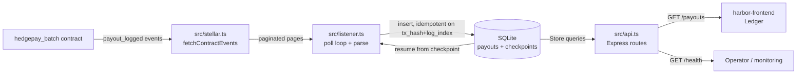

<div align="center">

<h1>Harbor Backend</h1>

<p><strong>Off-chain event listener, payout indexer, and REST API for Harbor.</strong></p>

<p>
  Watches the <code>hedegpay_batch</code> Soroban contract for <code>payout</code> events,<br/>
  indexes them into SQLite (idempotent on <code>tx_hash + log_index</code>), and serves them over a small REST API.
</p>

<p>
  =22.5" />
  
  
  
  
</p>

<p>Part of the <a href="https://github.com/Harbor-hq">Harbor</a> ecosystem.</p>

<br/>

</div>

---

## Overview

`harbor-backend` is the off-chain data layer of the Harbor payroll protocol. It does three things:

1. **Listens** — polls the Soroban network for `payout` events emitted by the `hedgepay_batch` contract, resuming from stored checkpoints so nothing is lost across restarts.
2. **Indexes** — writes events into a local SQLite database, idempotent on `(tx_hash, log_index)`.
3. **Serves** — exposes them over a small REST API consumed by [harbor-frontend](https://github.com/Harbor-hq/harbor-frontend).

Built with Node + TypeScript, `@stellar/stellar-sdk`, Express, and Node's built-in `node:sqlite` — no ORM, no database dependency.

---

## Table of Contents

- [Installation](#installation)
- [Quick Start](#quick-start)
- [Configuration](#configuration)
- [API Reference](#api-reference)
- [Architecture & Flow](#architecture--flow)
- [Test Coverage](#test-coverage)
- [Design Principles](#design-principles)
- [Contributing](#contributing)
- [License](#license)

---

## Installation

```bash
git clone https://github.com/Harbor-hq/harbor-backend.git
cd harbor-backend
npm install
```

Requires Node.js **>= 22.5** (tested on Node 22 and 24 LTS, configuration managed via `.nvmrc` for version locking).

---

## Quick Start

```bash
cp .env.example .env   # then fill in CONTRACT_ID
npm run dev            # tsx watch, listens on :8787
```

By default the service runs on the public Soroban testnet with a **mock** contract id so it boots without setup — set `CONTRACT_ID` to your deployed `hedgepay_batch` contract to index real events.

### Scripts

| Script              | What it does                          |
| ------------------- | ------------------------------------- |
| `npm run dev`       | Run with hot reload (`tsx watch`)     |
| `npm run build`     | Compile TypeScript to `dist/`         |
| `npm start`         | Run the compiled `dist/`              |
| `npm run typecheck` | `tsc --noEmit`                        |
| `npm test`          | Run the unit tests (`node:test`)      |

---

## Configuration

All configuration flows through `getConfig()` (env -> default). See `.env.example`:

| Variable           | Default                          | Purpose                        |
| ------------------ | -------------------------------- | ------------------------------ |
| `RPC_URL`          | soroban-testnet                  | Soroban RPC endpoint           |
| `CONTRACT_ID`      | mock placeholder                 | `hedgepay_batch` contract address |
| `TOKEN_SYMBOL`     | `USDC`                           | Token label surfaced in the API |
| `TOKEN_DECIMALS`   | `6`                              | Decimal places used to format amounts |
| `HOST` / `PORT`    | `0.0.0.0` / `8787`               | HTTP server bind               |
| `POLL_INTERVAL_MS` | `5000`                           | Event listener poll interval   |
| `START_LEDGER_BACK`| `10`                             | Ledgers back to index on first run |
| `DB_PATH`          | `./data/harbor.db`               | SQLite database file           |
| `CORS_ALLOWED_ORIGINS` | `http://localhost:3000`      | Comma-separated list of allowed origins (or `*`) |

### CORS Security & Tradeoffs

Harbor restricts access to the REST API by validating cross-origin requests. 

- **Security Profile:** By default, it allows requests originating from `http://localhost:3000` (typical frontend development server).
- **Production Deployment:** Set `CORS_ALLOWED_ORIGINS` to your production frontend domains (e.g. `https://harbor.finance,https://admin.harbor.finance`).
- **Tradeoff (Wildcard vs Strict):** Setting `CORS_ALLOWED_ORIGINS` to `*` allows any external site to read payout events and index status from your API, which may pose a privacy or scraping risk depending on the sensitivity of your transaction volume. Restricting it strictly prevents unauthorized domain access.

---

## API Reference

### `GET /health`

Listener + indexer status.

```json
{
  "status": "ok",
  "contractId": "C...",
  "rpcUrl": "https://soroban-testnet.stellar.org",
  "listener": {
    "running": true,
    "lastPoll": 1785850523766,
    "lastError": null,
    "processed": 12
  },
  "index": {
    "lastLedger": 123456,
    "payoutCount": 42
  }
}
```

### `GET /payouts`

List indexed payouts, newest first. Paginated and filterable.

| Param     | Type   | Default | Description                          |
| --------- | ------ | ------- | ------------------------------------ |
| `limit`   | number | `50`    | Page size (max `200`)                |
| `cursor`  | number | —       | Cursor from a previous `nextCursor`  |
| `batchId` | string | —       | Filter by batch id                   |
| `payee`   | string | —       | Filter by exact payee address        |

```json
{
  "payouts": [
    {
      "txHash": "deadbeef...",
      "index": 0,
      "batchId": "7",
      "payee": "GA5G2...",
      "amount": "250.5",
      "token": "USDC",
      "date": "2026-05-10T12:00:00.000Z",
      "ledger": 123456
    }
  ],
  "nextCursor": 42
}
```

### `GET /payouts/:txHash`

Fetch the first payout event for a transaction hash.

- `200` — the payout (same shape as an item above)
- `404` — `{ "error": "not_found", "message": "Payout not found" }`

The `/payouts` shape matches what harbor-frontend's `fetchPayoutEvents` consumes, so a frontend can point `NEXT_PUBLIC_HARBOR_EVENTS_URL` at this service. See [docs/API.md](docs/API.md) for the full reference.

---

## Architecture & Flow

The following **Mermaid** diagram renders natively on GitHub:



And the equivalent ASCII flow:

```
 +---------------------+   payout_logged    +------------------------+
 | hedegpay_batch      |-------------------->| src/stellar.ts        |
 | (Soroban contract)  |                     | fetchContractEvents   |
 +---------------------+                     +-----------+-----------+
                                                          |  paginated pages
                                                          v
                                                +------------------------+
                                                | src/listener.ts       |
                                                | checkpointed poll loop|
                                                | parsePayoutEvent      |
                                                +-----------+-----------+
                                                          |  insert (idempotent)
                                                          v
                                                +------------------------+
                                                | SQLite                |
                                                | payouts + checkpoints |
                                                +-----------+-----------+
                                                          |  Store queries
                                                          v
                                                +------------------------+
                                                | src/api.ts (Express)  |
                                                | GET /health           |
                                                | GET /payouts          |
                                                | GET /payouts/:txHash  |
                                                +-----------+-----------+
                                                          |
                                                          v
                                                +------------------------+
                                                | harbor-frontend Ledger |
                                                +------------------------+
```

### Module map

| Module | Responsibility |
| --- | --- |
| `src/config.ts` | Env configuration (env -> default). |
| `src/stellar.ts` | All Soroban RPC access — server + paginated event fetch. |
| `src/listener.ts` | Checkpointed poll loop; decodes `payout` events into records. |
| `src/db.ts` | SQLite schema + queries via the `Store` class. |
| `src/amount.ts` | i128 <-> decimal amount helpers. |
| `src/api.ts` | Express HTTP API. |
| `src/server.ts` | Entry point — boots listener + API, graceful shutdown. |

---

## Test Coverage

`node:test` suites ship for the amount helpers and the listener:

```bash
# Run locally
npm test
```

See [docs/ROADMAP.md](docs/ROADMAP.md) for the next contribution opportunities (index `executed` batches, real SEP-24/31 anchors, API-key auth, Zod validation, Dockerization, Prometheus metrics, multi-contract support, ERP sync).

---

## Design Principles

**Dependency-light** — uses `node:sqlite`; no ORM, no runtime deps beyond Express and the Stellar SDK. No new runtime dependencies without discussion in the PR.

**Idempotent by design** — payouts are keyed on `(tx_hash, log_index)` with `INSERT OR IGNORE`; the listener resumes from checkpoints, so replays and restarts are always safe.

**Single seams** — all network/contract access stays in `src/stellar.ts`; all store access goes through the `Store` class in `src/db.ts`; endpoints never issue raw SQL.

**BigInt-safe amounts** — i128 amounts are stored as `TEXT` base units to avoid precision loss in SQLite, and formatted with `fromBaseUnits` (`src/amount.ts`).

**Small surface** — three endpoints, one listener, one database. Everything else is a candidate for a PR, tracked in the roadmap.

---

## Troubleshooting

### SQLite Database Locking (`SQLITE_BUSY`)
If you see database busy errors, ensure only one instance of `harbor-backend` is running against the SQLite file. The store is configured with Write-Ahead Logging (WAL) mode and a 5000ms busy timeout to prevent write locks, but parallel execution of multiple processes on the same database file should be avoided.

### Soroban RPC Connection Timeouts
If the off-chain listener fails to poll the network and logs connection errors or HTTP timeouts:
1. Double-check your `RPC_URL` configuration in the `.env` file.
2. If using the default public Testnet RPC (`https://soroban-testnet.stellar.org`), it may occasionally experience rate-limiting. Try utilizing a private RPC provider or local Quickstart instance.

### Listener Restarts and Checkpointing
The listener is checkpointed per contract, saving the sequence of the last processed ledger sequence in the database. If you need to force the indexer to re-index older payouts, you can manually clear the checkpoint row:
```sql
DELETE FROM checkpoints WHERE contract_id = 'your_contract_id';
```
Or delete the SQLite database file (specified by `DB_PATH`) to completely rebuild the database from the `START_LEDGER_BACK` setting.

---

## Contributing

Pull requests are welcome. For significant changes, please open an issue first to discuss what you'd like to change.

See [CONTRIBUTING.md](CONTRIBUTING.md) for development setup, ground rules, the PR workflow, and the reviewer checklist.

Verify before pushing:

```bash
npm run typecheck
npm test
npm run build
```

---

## License

[MIT](LICENSE)
